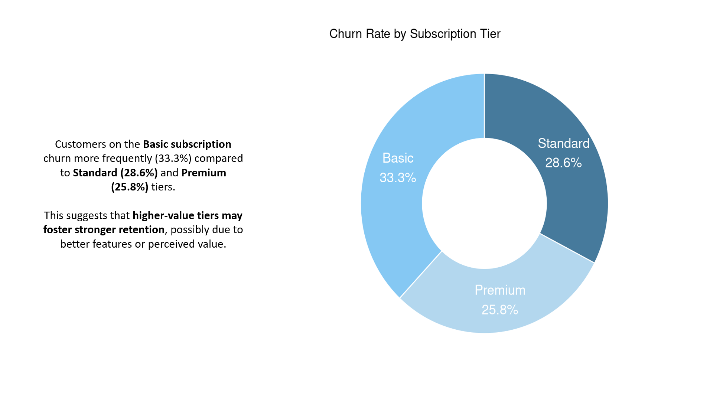

# Project Overview

This project explores key business KPIs using **simulated e-commerce data** (Amazon-like), focusing on customer retention, purchase behavior, and product performance.  
The objective was to **identify hidden patterns** and guide strategic decisions around **pricing**, **subscriptions**, and **customer segmentation**.

---

## Tools & Technologies

- SQL 
- R (dplyr, ggplot2, tidyverse)  
- Excel  
- PowerPoint

---

## Key Analyses Performed

- **Churn Rate by Subscription Tier:**  
  Calculated churn using `subscription_end` dates. Basic tier had the **highest drop-off rate**.

- **Customer Type Segmentation:**  
  Identified **One-Time vs Repeat Buyers** — 78% are repeat; further analyzed by **order frequency**.

- **Revenue by Product Category:**  
  **Wellness** and **Electronics** emerged as top contributors to total revenue.

- **Product Rating vs Price Analysis:**  
  Found that **low-rated products** had **higher average prices**, suggesting pricing mismatches.

- **Retention Strategy Design:**  
  Proposed **loyalty programs**, **targeted promotions**, and **pricing adjustments** based on insights.

---

##  Impact

- Uncovered pricing inefficiencies in low-rated products  
- Recommended promotional focus on top-selling categories  
- Simulated a retention model for converting Basic tier customers  
- Delivered clean, executive-friendly visuals using R markdown and PowerPoint

---
## Report Preview: 

##  View R Markdown Analysis:
[Click here](https://rpubs.com/Lekhana_S_0197/1323161)

